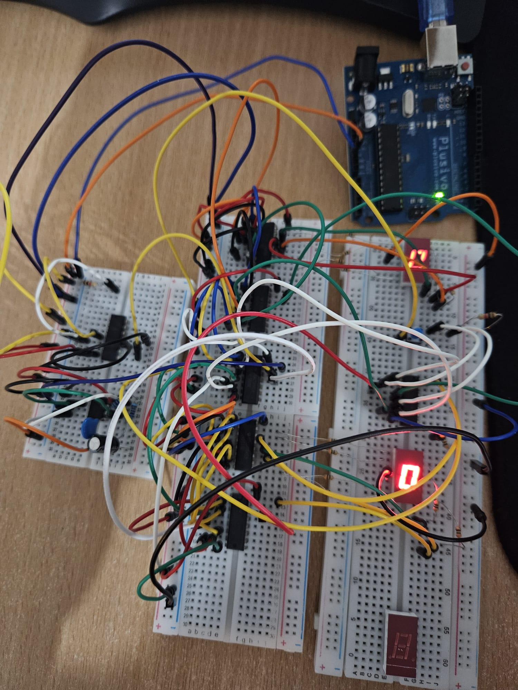
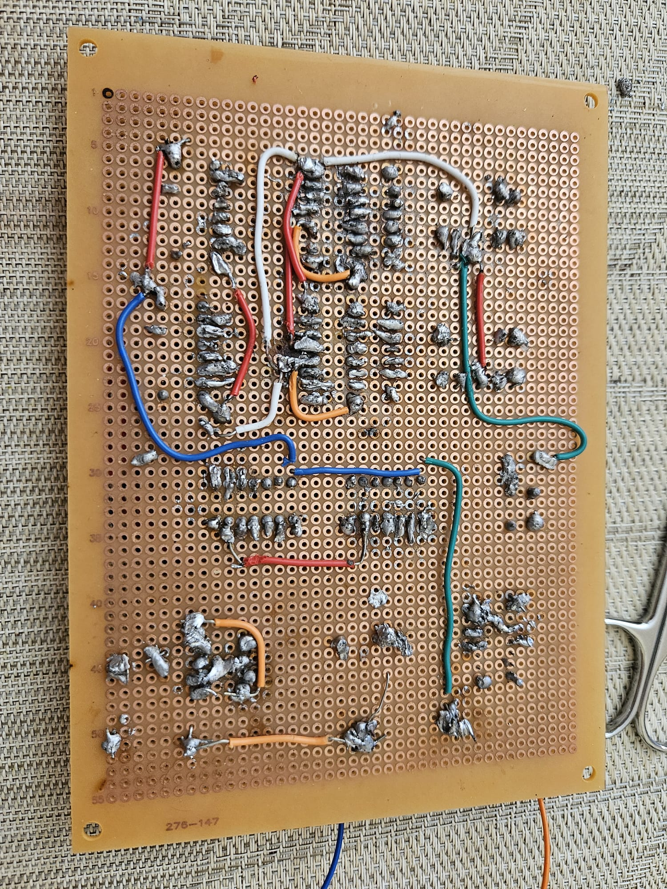

# Digital Stopwatch using TTL Logic & 74LS Series

## 📝 Project Overview
This project represents a hardware implementation of a **Digital Stopwatch** capable of counting seconds (0-59). It is built entirely using discrete logic gates, counters, and timers, without any microcontrollers (like Arduino or ESP32). The goal was to demonstrate a fundamental understanding of digital electronics, timing circuits, and PCB design.

## ⚙️ How It Works
The circuit operates on a 5V logic level and consists of three main stages:

1.  **Clock Generation (1Hz):**
    * Uses an **NE555P** timer configured in Astable mode to generate a precise 1Hz square wave (1 pulse per second).
2.  **Counting Logic:**
    * **Seconds (Units):** A **74LS193** 4-bit counter counts from 0 to 9. Logic gates reset it when it reaches 10 and trigger the next stage.
    * **Seconds (Tens):** A second **74LS193** counts the tens digit. Logic gates reset it when it reaches 6 (since seconds go up to 59).
3.  **Display & Control:**
    * **CD4511** BCD-to-7-Segment decoders convert the binary output of the counters into visual numbers on the LED displays.
    * **Start/Stop Logic:** Implemented using **74LS73 JK Flip-Flops**.
    * **Reset:** A dedicated button clears all counters to zero.

## 🛠️ Hardware Components
The project is built using standard Through-Hole (DIP) components:

| Component | Description | Function in Circuit |
| :--- | :--- | :--- |
| **NE555P** | Precision Timer | Generates the 1Hz clock signal for timekeeping. |
| **SN74LS193N** | 4-Bit Binary Counter | Counts the pulses (Up/Down counter). |
| **CD4511BE** | BCD-to-7-Segment Decoder | Drives the LED display segments based on binary input. |
| **SN74LS73AN** | Dual JK Flip-Flop | Manages the Start/Stop state logic. |
| **CD4071BE** | Quad 2-Input OR Gate | Logic conditioning for reset sequences. |
| **SN74LS08N** | Quad 2-Input AND Gate | Logic conditioning for counter limits (Modulo-10/6). |
| **7-Segment Display** | Common Cathode | Visual output for the time. |
| **Passive Components** | Resistors, Capacitors, Buttons | Signal conditioning and user input. |

## 📸 Gallery

### Breadboard Prototype
Before soldering, the circuit was validated on a breadboard.

### PCB Implementation (Soldered)
The final version was transferred to a perforated board for stability.

